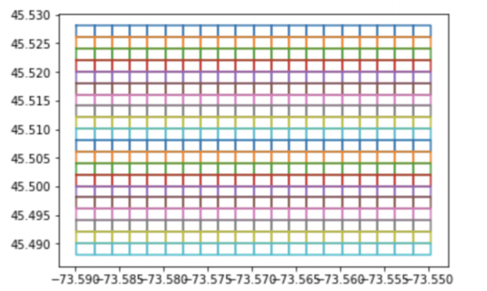
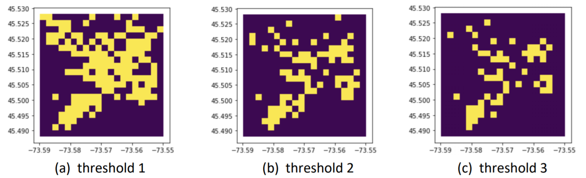
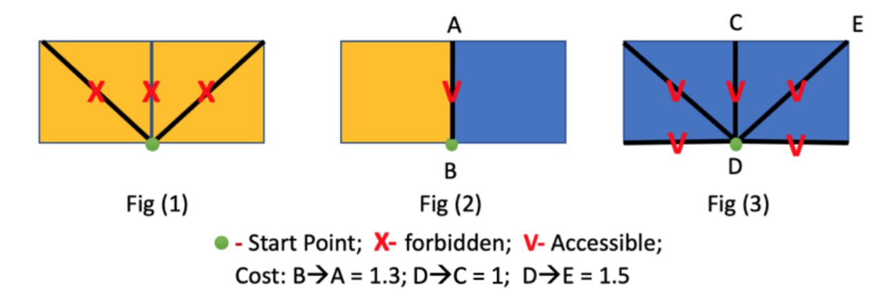

# a-search-algorithm

Design a A\* Search heuristic function in Python

## Instructions

Using GPS coordinates in `the crime_dt.shp` generate grids then compute and represent crime rate
statistics in each grid then design and implement a A\* Search heuristic search algorithmm to find the optimal
path between two coordinates.

The dataset is fetched and modified from the City of Montreal's open data portal. To ensure accuracy of the data, use grid size of 0.002 \* 0.002. Each point define in the file represents 1 crime a along the area. A high crime rate area is defined as a grid where the # of crimes is higher than the threshold defined. The threshold is defined at the beginning of the program. It should be either 50%,75% or 90%. (yellow grids as high crime rate and purple grids as low crime rate)

For example, we have the sequence {10, 9, 8, 7, 6, 5, 4, 3, 2, 1}
If the threshold = 50%, the numbers {10, 9, 8, 7, 6} are considered as high crime rate;
If the threshold = 75%, the numbers {10, 9} are considered as high crime rate;
If the threshold = 90%, the numbers {10} are considered as high crime rate.

Using the graph, where yellow grids are obstacles, find an optimal path from any two coordinates that the user prompts within the map. You can use any python libraries: Pandas, Numpy, Pyshp, Scikit-Learn, matplotlib, geopandas, tkinter but do not use an existing search function. You must design your own heuristic.

Some rules for the heuristic search

1. Avoid Yellow grids
2. All edges between 2 yellow grids and diagonal are forbidden
3. All edgees between a yellow and a purple grid are accesible and cost 1.3
4. All edges between 2 purple grids are accessible and orthogonal edges cost 1, diagonals 1.5
5. All the boundary edges of the map are considered as inaccessible.
6. If the point P is located inside one grid, use the lowest coordinates in this grid as the
   location. This coordinate is the left bottom coordinates of this grid.

Displaying the map with colored grids and search path is required, but it is not necessary to have a fancy user-interface for inputs. A simple command-line interface with a direct output is sufficient.

to load and read the “crime_dt.shp” file, the other four files “crime_dt.cpg”, “crime_dt.dbf”,
“crime_dt.prj”, and “crime_dt.shx” in the same folder named “Shape”
attached should be put in the same local path.
